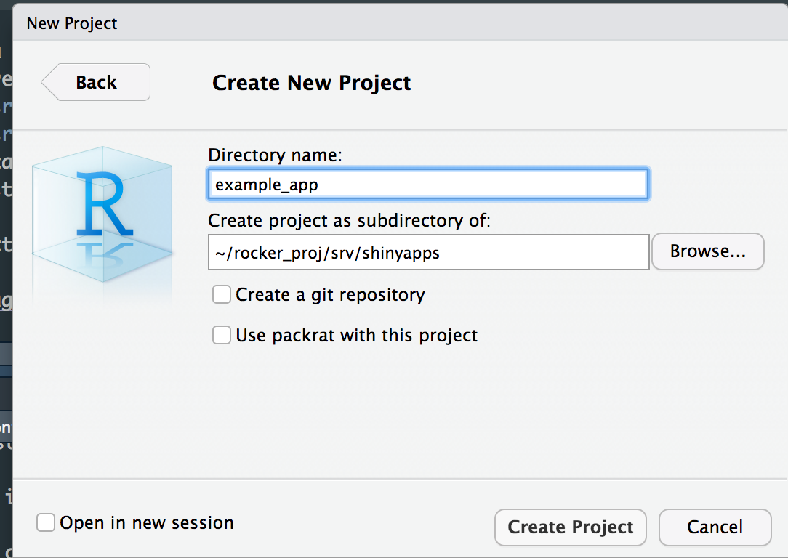
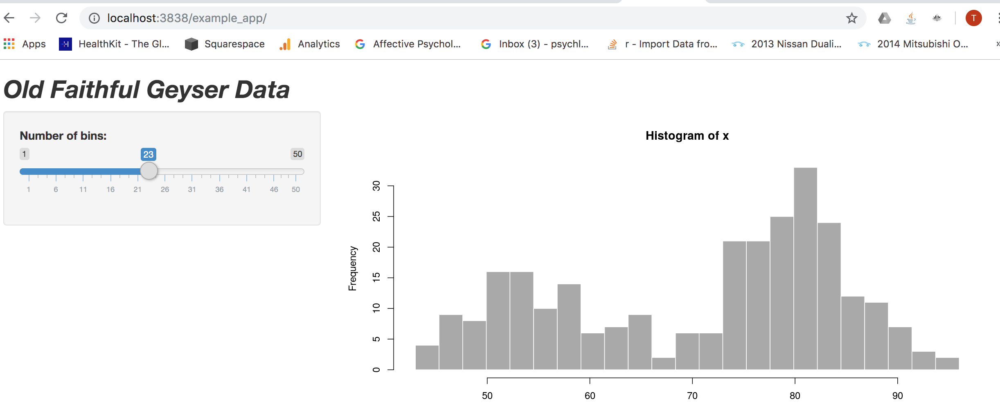

<style>
body.blue { background-color:#659dbd;}
</style>


```{r, echo = FALSE}

knitr::opts_chunk$set(echo = TRUE, warning=FALSE, message = FALSE, out.width = '100%')

```

In this post I demonstrate how to deploy a Shiny app to your local browser using Docker. By stepping through this process, I pave the way for more complex deployments and hosting solutions.

To begin, create a project folder on my local drive

```{zsh, eval = FALSE}

mkdir rocker_proj

```

Then retrieve the `rocker\shiny-verse` image from Dockerhub. 

```{zsh, eval = FALSE}

docker pull rocker\shiny-verse

```

Check that the image is showing up locally

```{zsh}

docker image ls

```

Yes!

Now spin up a container using the image I just downloaded:

```{zsh, eval = FALSE}

docker container run --rm -p 3838:3838 -v /Users/timothyjamesdeitz/rocker_proj/srv/shinyapps/:/srv/shiny-server/ -v /Users/timothyjamesdeitz/rocker_proj/srv/shinylog/:/var/log/shiny-server/ rocker/shiny-verse

```

The -v flag refers to a volume. Volumes let the container access local files on the host. Here I specify two volumes, which share an overarching directory `srv`. One of the volumes will contain the app itself, `/Users/timothyjamesdeitz/rocker_proj/srv/shinyapps/`, and the other will contain the app logs `/Users/timothyjamesdeitz/rocker_proj/srv/shinylog/:/var/log/shiny-server/`. As specified on the Dockerhub page, the container should run on port 3838, so I indicate this above. I also ensure that the container will be destroyed as soon as we take it down, using the `--rm` flag. The last part of the call `rocker/shiny-verse` refers to the name of the image itself. It is important to note that the shell prompt will be unavailable while the container is running. To solve this, I could have run the container in the background, using the `-d` flag.

Next, I create a new R Studio Project (a shiny app) inside the `/shinyapps/` subfolder.



Finally, I head to the browser and check that the app is appearing:



That's all there is to it!

Also notice that because I created a volume, I can edit the app code itself and changes will immediately show up in the browser. For example, you can see that I've boldened and italicised the slider label (it wasn't like that originally).


<body class = "blue">


</body>
