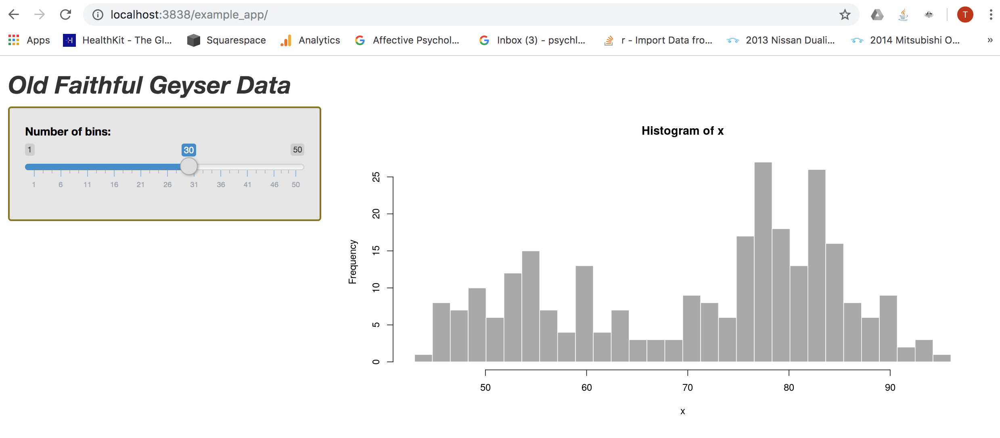

<style>
body.blue { background-color:#659dbd;}
</style>


```{r, echo = FALSE}

knitr::opts_chunk$set(echo = TRUE, warning=FALSE, message = FALSE, out.width = '100%')

```

In this post, I demonstrate how encode files need for my Shiny app within a custom Dockerfile. So, rather than building a container with a pre-existing Docker image, I make my own custom image.

Start by examining which images I have stored on my machine: 

```{zsh, eval = FALSE}

docker image ls

```

```{zsh, eval = FALSE}

REPOSITORY                      TAG                 IMAGE ID            CREATED             SIZE
rocker/shiny-verse              latest              94490fbd4d3b        9 days ago          1.86GB
mysql                           latest              d435eee2caa5        3 weeks ago         456MB
nginx                           latest              231d40e811cd        3 weeks ago         126MB
bretfisher/jekyll-serve         latest              144799b59c39        5 months ago        269MB
openanalytics/shinyproxy-demo   latest              9a83d7d80ebf        10 months ago       925MB
postgres                        9.6.2               b3b8a2229953        2 years ago         267MB
postgres                        9.6.1               4023a747a01a        2 years ago         265MB

```


As you can see, the `rocker/shiny-verse` image is available from when I last pulled it from Dockerhub.

Now I'm going to make a new Dockerfile that hardcodes the styling of my Shiny app. Normally the css stylesheet for a Shiny app is stored in a `www` folder, which is situated in the same directory as your app files. 

Below, I navigate to the root of the folder in which my Shiny app is contained and create the Dockerfile.

```{zsh, eval = FALSE}

cd rocker_proj

touch Dockerfile

```

The Dockerfile is blank when I open it. I add the following content, which is explained below:

```{zsh}

cat Dockerfile

```
All dockerfiles need to begin with the `FROM` instruction. This instruction indicates the parent image from which you are building. The `WORKDIR` command sets the working directory for any `RUN`, `CMD`, `ENTRYPOINT`, `COPY` and `ADD` instructions that come after it in the dockerfile.
The `COPY` instruction copies new files or directories from the source (i.e. the host) and adds them to the filesystem of the container. You can specify the path of the source but otherwise, this path will be taken from the build context (i.e. the folder you are in when you build the container). In this example, I am in the `rocker_proj` folder. From within this folder, the path to the `www` folder containing my stylesheet will be `/srv/shinyapps/example_app/www/`. We already know that within the container, the working directory is `/srv/shiny-server/`. When I add `example_app/www/` as the destination, these directories will be created with in the container as subdirectories of the working directory. Note that there is no `/` before the destination path — this ensures that Docker will treat it as a relative path (relative to `WORKDIR`) and not an absolute path.

According to Docker documentation, "You are strongly encouraged to use VOLUME for any mutable and/or user-serviceable parts of your image". Thus, I wouldn't ordinarily hardcode css styling into the image layers — because the styling is likely to need alteration over time. Rather, I should use the `COPY` instruction only for files that really aren't likely to change.

To build the image and store it locally, I run:

```{zsh, eval = FALSE}
docker image build -t custom_rocker .
```

The `-t` flag stands for the name of the "tag" I am giving the image: in this case, "custom_rocker". The dot `.` at the end means that the image should be built using the Dockerfile in the current folder. Also, if I wanted to push the new image to my Dockerhub repo, I would need to prefix tag with my username. So it would be `timothydeitz/custom_rocker".

Finally, I build the new container, as follows:

```{zsh, eval = FALSE}

docker container run --rm -p 3838:3838 -v /Users/timothyjamesdeitz/rocker_proj/srv/shinyapps/:/srv/shiny-server/ -v /Users/timothyjamesdeitz/rocker_proj/srv/shinylog/:/var/log/shiny-server/ custom_rocker

```

Which gives me the following output:

```{zsh, eval = FALSE}

[2019-12-11T11:32:16.945] [INFO] shiny-server - Shiny Server v1.5.12.933 (Node.js v10.15.3)
[2019-12-11T11:32:16.961] [INFO] shiny-server - Using config file "/etc/shiny-server/shiny-server.conf"
[2019-12-11T11:32:17.058] [WARN] shiny-server - Running as root unnecessarily is a security risk! You could be running more securely as non-root.
[2019-12-11T11:32:17.069] [INFO] shiny-server - Starting listener on http://[::]:3838
[2019-12-11T11:32:58.564] [INFO] shiny-server - Created bookmark state directory: /var/lib/shiny-server/bookmarks
[2019-12-11T11:32:58.566] [INFO] shiny-server - Created user bookmark state directory: /var/lib/shiny-server/bookmarks/shiny

*** '/var/log/shiny-server//example_app-shiny-20191211-113258-36645.log' has been created ***

*** /var/log/shiny-server//example_app-shiny-20191211-113258-36645.log ***

Listening on http://127.0.0.1:36645
```

To check that the css styling has been encoded into the image itself, I remove the `www` folder from my local shiny app directory. Then I head to the browser at `http://localhost:3838/example_app/` to check it out:



Success! I now have a custom border around the side panel.

<body class = "blue">


</body>
